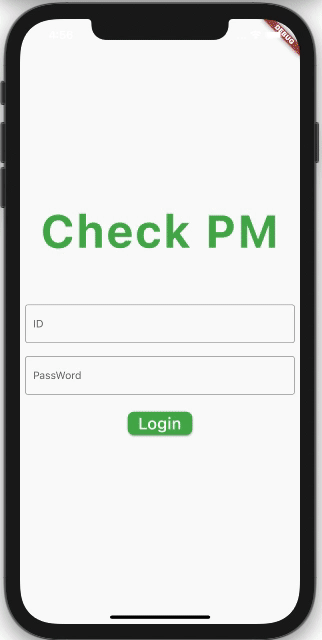
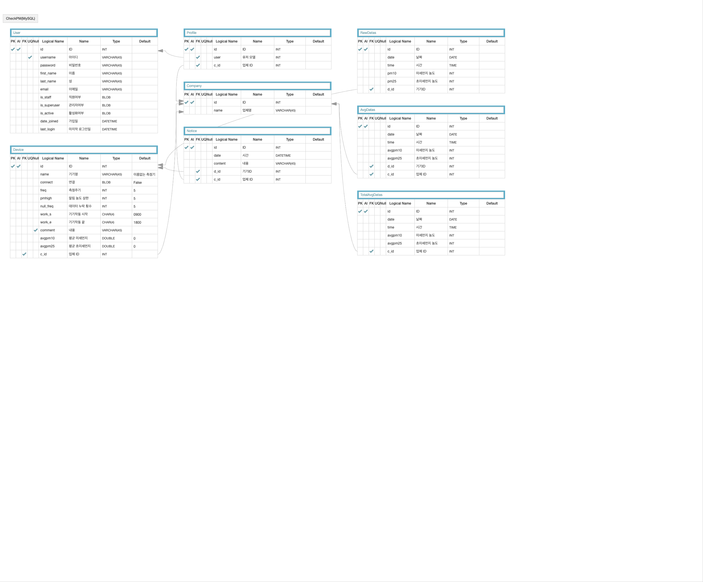

# CheckPM
## 마이크로콘트롤러를 이용한 미세먼지 측정 및 관리 프로젝트
---
## 개요
- Project Manager : 김현균
- Version Number : V0.2
- Written Date : 2021.01.25
---
## App Work

---
## [Rest API 규격서](https://github.com/Ksanbal/CheckPM/blob/main/Restful%20API%20%EC%97%B0%EB%8F%99%20%EA%B7%9C%EA%B2%A9%EC%84%9C.md)

---
## ERD

## [테이블 정의서](./img/테이블 정의서.xlsx)
